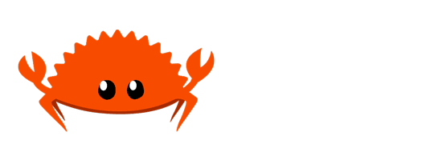
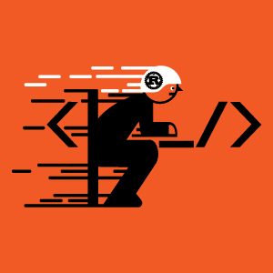

## Rustln

Hi, I'm Rustln, C# Developer at day, Rustacean at night.

> We love you C#, but Rust is just better.

### 名字的由来

#### 英文名

**`Rustln`** 名字的由来得从 `Rust` 第一行代码说起：

```rust

println("{}", "hello world");

```

在这里有一个特别的单词 `println`，是由 `print` 和 `line` 两个单词组合而成，连在一起后使用 `ln` 缩写替代 `line`。

接着说说 `line` 这个单词在牛津字典中表示 **队伍，行，线** 等意思，加上第一眼看到 `Rust` 时起就坠入爱河，**于是把 `Rust` 和 `ln` 组合在了一起**，表示加入 `Rust` 语言**队伍**，转入 `Rust` 这一**行**。

另外 `ln` 和 `lang(language)` 读音上较接近，也可以看作是 `lang` 的缩写。

#### 中文名

`锈郎` 是 `Rustln` 的中文名字，说起这个名字的来由更有意思，在 `Rust` 官方仓库 [https://github.com/rust-lang/rust](https://github.com/rust-lang/rust) 页面**不小心点击了浏览器自带的翻译工具并翻译成中文 (简体) 后**，`rust-lang/rust` 惊奇的被翻译成了 **`锈郎/锈`**！！！

从此，**`锈郎`** 便成为了 `Rustln` 的中文名。

### 标志设计理念

<div align="center">



</div>

标志围绕着 `Rust`、`安全`、`极快`、`<_/>`、`电脑`、`Rustln`，`专注`，`激情` 这 7 个元素进行设计：

- **`Rust`**：主人公戴着一顶白色帽子，帽子的标志正是 `Rust` 的 LOGO，说明主人公熟悉 `Rust` 编程语言

- **`安全`**：白色帽子表示安全作业，寓意着 `Rust` 是一门强安全性的编程语言

- **`极快`**：左侧白色和黑色小胶条呈现出 “飞驰” 的既视感，代表 `Rust` 拥有极速的性能

- **`<_/>`**：代码的互联网符号，说明主人公是从事编程工作

- **`电脑`**：结合 `_/` 符号模拟出电脑的形态，表示主人公使用的工具是电脑

- **`Rustln`**：主人公的坐姿是由 `R U S T L N` 拆解组合而成，坐姿包含了这 6 个字母，也正是主人公互联网的公开账号

- **`专注`**：从整体来看，主人公正在专注自己做的事情，比如编程

- **`激情`**：背景颜色采用橙色，橙色代表激情，表达主人公对编码的热情始终不减
